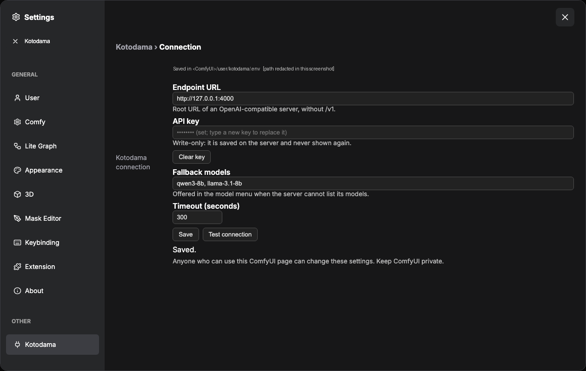
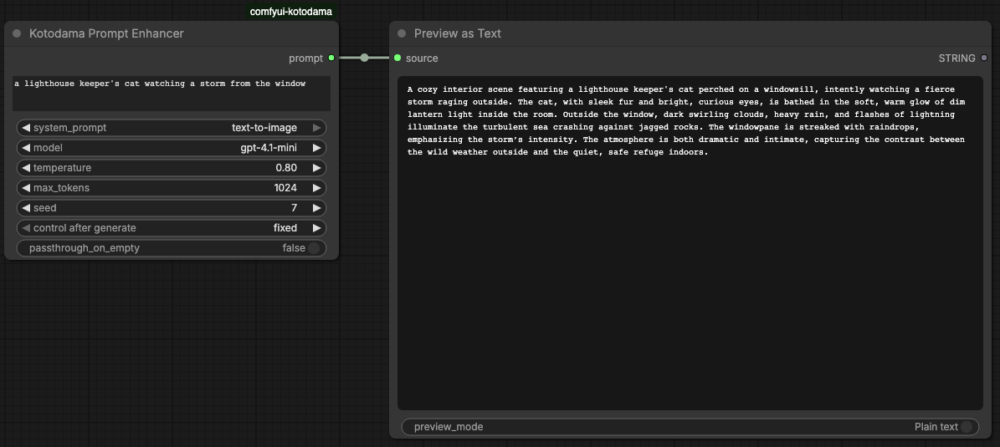

# Kotodama for ComfyUI

Kotodama takes a rough text idea, asks an OpenAI-compatible chat model to rewrite it as an image prompt, and returns a `STRING` for `CLIPTextEncode`. It accepts **text only**. It does not inspect reference images.


## What it does

One real run: the same image model and the same seed, rendered from each prompt.

| Your rough idea | Kotodama's prompt |
|---|---|
|  |  |
| *a lighthouse keeper's cat watching a storm from the window* | *A lighthouse keeper's cat sits in profile on a wide bay window ledge, gazing out at a raging storm through the rain-streaked glass. The cat is a fluffy tabby with striking green eyes … occasional forks of lightning illuminating the churning sea far below. Inside, warm lamplight glows against the cool blue-gray tones of the tempest …* |

Two more runs (same preset, seed 11 for the image), rough idea on the left, Kotodama's prompt on the right:

| *an old robot tending a rooftop garden at dawn* | Kotodama |
|---|---|
|  |  |

| *a noodle stall on a rainy night street* | Kotodama |
|---|---|
|  |  |

The enhancer adds specific, steerable detail (the tabby's green eyes, the lightning, the lamplight on the glass), and the render follows it. These are illustrative runs with the `text-to-image` preset on a local OpenAI-compatible model, each prompt generated in 3–5 s. Your model and seed will produce different text. These examples are illustrations, not evidence. The evidence is below.

### Evaluation

In a 12-case authored paired-image pilot, two blinded AI-agent raters each chose the Kotodama-enhanced image for idea match on 8 of 12 cases and each counted five more visible details out of 48.

**Scope:** one image seed per case; the raters are AI agents, not people; prompt and image model weights and the endpoint/host runtime are not pinned by hash. So this makes no population or human-preference claim. One case (`spatial-04`) was a shared win for the rough prompt. Every pair, rating, disagreement and raw receipt is in [`evals/results/pilot-2026-09-25`](evals/results/pilot-2026-09-25).

## Install

**From ComfyUI-Manager (recommended):** open **Custom Nodes Manager**, search for **Kotodama Prompt Enhancer**, install, and restart ComfyUI. It is published on the [Comfy Registry](https://registry.comfy.org/nodes/comfyui-kotodama) as `comfyui-kotodama`.

**With comfy-cli:** `comfy node install comfyui-kotodama`

**Manually:** clone or copy this repository into `ComfyUI/custom_nodes/comfyui-kotodama`, then restart ComfyUI. The node uses Python's standard library and needs no extra package install.

## Configure

**In ComfyUI (recommended).** Open **Settings** (the gear, bottom left) → **Kotodama**, then fill in:

- **Endpoint URL**: the root of any OpenAI-compatible server, **without `/v1`** (for example `http://127.0.0.1:4000`). Kotodama calls `/v1/models` for the model menu and `/v1/chat/completions` to run.
- **API key** (optional for a trusted local server): **write-only**. It is saved on the server and never shown again; type a new one to replace it, or **Clear key**.
- **Fallback models**: exact model IDs to offer if the server cannot list its models.
- **Timeout (seconds)**: defaults to 300.

Click **Save** (it asks you to confirm an endpoint change), then **Test connection**, which checks only the saved settings. They're stored in `<ComfyUI user directory>/kotodama/.env`, so they survive node updates.



> **Anyone who can use your ComfyUI page can change these settings.** ComfyUI has no login by default, so keep it private. The key is never sent back to the browser.

- **Behind an HTTPS reverse proxy?** The panel only accepts saves from ComfyUI's own origin. Set `KOTODAMA_ALLOWED_ORIGINS` (comma-separated, exact origins such as `https://comfy.example.com`) in the environment or the `.env` file, otherwise saving is refused with `cross_origin`.
- **Key set in the environment or the node folder's `.env`?** The panel won't change the endpoint or clear the key (`key_outside_panel`), so a key can never be sent to a new server behind your back. Change both where the key lives.

**Alternative: environment variables or a `.env` file.** These still work and **take precedence** over the panel (the panel says when they do). Copy `.env.example` to `.env` in this node folder:

```dotenv
KOTODAMA_BASE_URL=http://127.0.0.1:4000
KOTODAMA_API_KEY=your-key-if-required
KOTODAMA_FALLBACK_MODELS=your-model-id
```

Use HTTPS for a remote service. Existing installs using `LITELLM_BASE_URL` and `LITELLM_API_KEY` continue to work; the `KOTODAMA_*` names win when both are present. `KOTODAMA_TIMEOUT` has a one-second minimum. Precedence is process environment, then `<ComfyUI user directory>/kotodama/.env`, then `.env` in this node folder.

**Keep the API key out of node widgets.** ComfyUI saves widget values in workflow JSON and may embed them in generated PNG metadata. `.env` is ignored by Git; keep the file private and restrict access to your ComfyUI host. Anyone who can administer an exposed ComfyUI instance may be able to run nodes or inspect its files, so protect ComfyUI itself.

## Try the example

Open `examples/kotodama-preview-api.json` in ComfyUI (**Workflow → Open**, or drag the file onto the canvas). It is two nodes: Kotodama feeding a **Preview Any** node that shows the generated prompt. Pick a model from the node's model menu (the file ships with a placeholder), then **Queue**.

 No image model is needed to see what Kotodama writes. To render it, connect `prompt` to `CLIPTextEncode.text` in your own workflow.

## Use

Add **Kotodama Prompt Enhancer**, enter or connect rough `text`, select a system prompt and model, then connect its `prompt` output to `CLIPTextEncode.text`. To expose that input on CLIPTextEncode, right-click the node and choose **Convert widget to input → text**.

The default `text-to-image` system prompt works from text alone. The `krea2` preset is retained for existing workflows and has been adjusted to work from text only. You can add your own `.md` or `.txt` file to `system_prompts/` and refresh the browser; its stem appears in the menu. Editing the selected file changes the node's cache identity on the next run. The node strips `### START ###` and `### END ###` banner lines from prompt files.

Changing a widget or the selected prompt file reruns the node. To request another response with otherwise identical inputs, change `seed`. The seed is sent to the chat endpoint, but a provider may ignore it. An empty input is an error by default; enable `passthrough_on_empty` only if an empty downstream conditioning string is intentional.

The node fails visibly on connection, authentication, malformed response, truncated output, and empty output. It will not silently replace a failed request with a blank prompt.

## Privacy and troubleshooting

Your input text and selected system prompt are sent to the configured chat endpoint. Choose an endpoint whose data handling fits your workflow. The generated prompt can also be saved with the workflow or image by ComfyUI.

- **Configure endpoint or fallback model** shows in the model menu: set the **Endpoint URL** in Settings → Kotodama and, if `/v1/models` is unavailable, **Fallback models**; then refresh ComfyUI's node menu.
- **401/403**: re-enter the **API key** in Settings (or check `KOTODAMA_API_KEY` if you use env vars) and your provider's permissions.
- **Connection or timeout**: check the endpoint from the ComfyUI host; raise **Timeout** in Settings, lower `max_tokens`, or use a faster model if generation is slow.
- **Redirect response**: set the **Endpoint URL** to the final endpoint. Kotodama refuses redirects so the bearer key cannot be forwarded to another URL.
- **Wrong model list**: set **Fallback models** to the provider's exact IDs and refresh. A fallback menu does not confirm the endpoint is reachable.

## Tests

The offline suite runs without ComfyUI or a live provider. With [uv](https://docs.astral.sh/uv/):

```sh
uv run --group dev pytest
```

Or with plain pip: `pip install pytest aiohttp` and then `python -m pytest`.

The settings-route tests are included; they need `aiohttp` (part of the dev group, and already provided by ComfyUI).

To test a configured provider from its ComfyUI host, run `python3 tests/smoke.py your-model-id` with the same Python interpreter as ComfyUI. This sends one short test prompt to your endpoint.

## License

MIT. See [LICENSE](LICENSE).

## Credits

Maintained by Eric Mey. This public release was prepared with AI collaborators.
